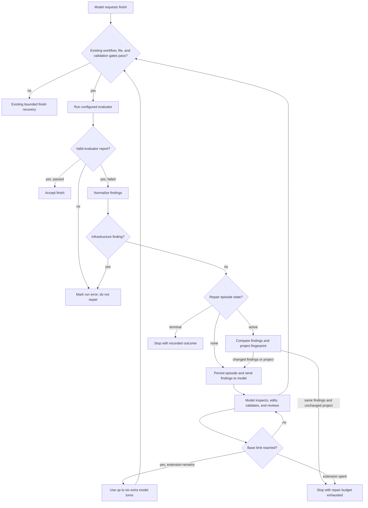

# Agent Lab Evaluator-Guided Repair Design

## Intent

Give an evaluated Agent Lab run one durable, bounded chance to repair a real
checker failure. The harness should show the model exactly what failed, where
to look, and whether its next changes helped. The model remains responsible for
inspecting and editing its project; the harness remains responsible for
validation, workflow evidence, limits, and the final pass decision.

This design follows the latest Gemma E2B catalog measurements. With constrained
action output, six of twelve cells passed in the uniform matrix. File
round-trip passed at all three reasoning levels, and Structured Validation
passed at Standard and Deep. Static Page Standard repeated a missing
`replace_text.args.new_text`; Static Page Deep and both non-Off Mini Project
runs hit the 18-turn limit. Mini Project Off and Structured Validation Off
repeated an invalid workflow phase. After the phase error began listing valid
values, Structured Validation Off passed, while Mini Project Off still failed
`semantic_main`, `responsive_css`, and `focus_style`. The data now points to
checker-guided repair and completion efficiency as the next capability gap.

## Goals

- Convert evaluator output into a small, stable set of findings with a check ID,
  plain-language message, and optional relative artifact hints.
- Preserve compatibility with current checkers that return `passed` and a map
  of boolean `checks`.
- Start at most one evaluator-repair episode per evaluated run, only after the
  normal workflow, required-file, and validation gates have passed and the
  configured evaluator has returned a valid failure report.
- Extend one uninterrupted run's normal turn limit by at most six model turns
  for that episode; six is a hard ceiling and the default allowance. The
  default `max_turns` remains 18, so one uninterrupted run can use at most 24
  turns; existing explicit-resume semantics can grant a new
  normal budget, but never replenish the episode's six-turn extension.
- Stop earlier when the same findings recur against an unchanged project, or
  when the model repeats an existing non-evaluator failure under the current
  bounded recovery policy.
- Preserve all existing workflow gates, approval behavior, tool guards,
  workspace isolation, and honest evaluator authority.
- Persist enough episode state to resume an interrupted run without resetting
  its repair allowance.
- Make diagnosis, repair, recheck, pass, and stop events visible in the existing
  run activity surface and summary.
- Measure first-pass and repaired outcomes separately in benchmark reports.

## Non-goals

- No harness-authored edits, automatic fixes, skipped checks, or inferred
  success. All project mutations still come from model tool actions and remain
  subject to the existing approval mode and path/command controls.
- No evaluator retries for timeouts, crashes, malformed output, or unavailable
  infrastructure. Those remain explicit evaluator errors, not model failures.
- No changes to interactive chat behavior in this version; chats have no
  external evaluator. The feature applies to catalog and other gated runs.
- No changes to model providers, hidden reasoning capture, the task catalog, or
  the meaning of existing `passed` and run `status` fields.
- No additional workflow phases. Existing `implement`, `verify`, and `review`
  evidence already describes repair work accurately.

## Architecture



The episode starts only when `finish_issue()` reaches the evaluator and gets a
valid failed report containing at least one requirement finding. Missing
workflow evidence, required files, or successful validation do not start an
episode. Once active, evaluator failures are handled by the repair controller
instead of the generic repeated-`finish_rejected`
counter. Protocol errors, failed tools, duplicate actions, and other non-
evaluator failures continue through the existing `RecoveryController`. If one
of those existing stop conditions ends the run, the episode is finalized as
`blocked` with that stop reason; an interruption alone leaves it active for
resume.

Each successful project mutation continues to invalidate validation and review
evidence as it does today. The model must run validation after its last change,
create a fresh `git_diff` review, and request finish again. `finish_issue()`
continues to run gates in their current order. Only a fresh evaluator pass can
complete the run successfully.

## Evaluator report format

Current evaluator output remains valid:

```json
{
  "passed": false,
  "checks": {
    "semantic_main": false,
    "responsive_css": false
  }
}
```

Checkers may add a `findings` array while retaining `passed` and `checks`:

```json
{
  "passed": false,
  "checks": {
    "semantic_main": false,
    "responsive_css": false
  },
  "findings": [
    {
      "id": "semantic_main",
      "message": "Put the primary page content inside a main element.",
      "artifacts": ["index.html"],
      "evidence": "No main element was found."
    },
    {
      "id": "responsive_css",
      "message": "Add a small-screen layout rule using a media query.",
      "artifacts": ["styles.css"],
      "evidence": "No media query was found."
    }
  ]
}
```

`agent-lab/harness/evaluation.py` owns normalization. It returns a versioned,
JSON-safe evaluation object while preserving the current `configured`, `passed`,
`exit_code`, `stdout`, and `stderr` fields. The report must contain a boolean
`passed`; when `checks` is present it must be a map of string IDs to booleans,
and when `findings` is present it must be a valid array of findings. A report
whose top-level pass flag contradicts its checks or findings is invalid and is
treated as an evaluator error. Normalized findings have `id`,
`message`, `artifacts`, and optional bounded `evidence`. If a legacy checker has
only boolean checks, each false check becomes a finding with a generated
message and no artifact hints. A valid failed report that normalizes to no
findings—including empty finding and check collections—becomes one generic
`evaluator_failed` requirement finding. Invalid JSON or missing `passed`,
invalid field types, contradictory results (such as `passed: true` with a
false check or finding), invalid finding kinds, duplicate finding IDs,
incompatible report shapes, timeouts, and evaluator launch errors are
evaluator errors. They end the run with status `error`, without model
repair or evaluator retry, and grant no extra model turns.

Messages and evidence are length-limited. Finding IDs are stable strings;
artifact hints must be non-empty relative project paths without `..`, absolute
roots, or drive prefixes. Hints guide model inspection but do not grant direct
filesystem access or alter the existing tool boundary. Output retains the
existing evaluator output cap.

## Repair episode policy

The new pure module `agent-lab/harness/repair_loop.py` owns the episode state
and policy. The lifecycle is `none -> active -> one terminal state`; only one
episode may exist per run, and a terminal episode can never be reopened. Its
persisted state includes:

- schema version and stable episode ID;
- status (`active`, `passed`, `blocked`, `no_progress`, or `budget_exhausted`);
- trigger turn and the initial normalized finding IDs;
- latest findings and latest evaluator outcome;
- the six-turn hard extension limit, episode model turns, and extension turns
  used;
- project and finding fingerprints from the last failed recheck;
- final outcome and a bounded event-history summary.

The project fingerprint is a hash of the same bounded project snapshot used by
the harness review flow; it contains no project contents. The finding
fingerprint is a hash of normalized IDs. A repair recheck with the same finding
fingerprint and unchanged project fingerprint ends the episode as
`no_progress`. A changed project with the same failures can continue, because
the model may have made a partial repair. A smaller or otherwise changed
finding set is recorded as progress. A passing evaluator ends the episode as
`passed`.

The normal `max_turns` budget is retained. If the base loop reaches its turn
limit while the one active episode remains unresolved, the harness may issue up
to `max_repair_turns` additional model turns (hard-capped at 6). An
uninterrupted run therefore uses at most 24 model turns with the current
default settings. Episode metrics include `repair_episode_turns` (model calls
from the triggering finish through the terminal transition) and
`extension_turns_used` (calls beyond the normal limit), where the latter is
capped at six for the entire episode. Extension use is not reset when an
interrupted run is resumed;
existing explicit resume behavior still grants its configured general run
budget, so cumulative turns across resumes may exceed 24 while the repair
extension remains capped at six total. If the episode passes, makes no progress,
or exhausts its extension,
the run ends with the corresponding honest outcome. The current run status
remains `success` only after all existing gates and the evaluator pass;
otherwise the run is `blocked` with the remaining finding IDs and stop reason.
An evaluator infrastructure error ends the run with status `error`, not
`blocked`.

Within an active episode, an evaluator failure no longer consumes the generic
repeated-finish retry counter. The episode controller applies the finding and
project fingerprints plus the total extension limit. Other failure categories
remain under the existing recovery controller, so malformed actions and
repeated tool failures still stop promptly. A hard stop from that controller
finalizes an unresolved episode as `blocked`; an interruption leaves the
episode active and resumable.

The model receives an operational repair instruction with the current findings,
artifact hints, evidence, progress since the prior evaluation, and turns
remaining. It is told to inspect relevant files, repair only what the evidence
supports, validate after edits, review the current diff, and request finish to
recheck. The instruction contains no hidden chain-of-thought request and does
not weaken existing workflow requirements.

## Persistence and events

`repair.json` is the canonical episode snapshot beside the run's existing
`progress.json` and `summary.json`. The summary and progress snapshots also
include a compact `repair_episode` view for API consumers. `resume_from_run()`
restores the snapshot and remaining extension; absence means no episode, which
keeps older run folders readable. An invalid snapshot must produce an explicit
resume error rather than silently grant a fresh allowance.

The event log adds:

- `repair_episode_started`: episode ID, trigger turn, finding IDs, extension;
- `repair_rechecked`: turn, pass/fail, finding IDs, and whether the project or
  findings changed;
- `repair_episode_finished`: terminal outcome, turns used, and remaining
  findings.

Events carry summaries and hashes only, not hidden reasoning. The UI's existing
event polling and activity feed render these events as diagnosis, repair,
recheck, success, or stop updates. The run Inspector shows episode status,
initial versus remaining findings, and turns used. No new API endpoint is
needed because the current run response already exposes summary and events.

The benchmark matrix retains its current final `passed` semantics and adds:
`first_pass_passed`, `repair_attempted`, `repair_outcome`,
`repair_episode_turns`, `extension_turns_used`, `initial_finding_ids`, and
`final_finding_ids`. `first_pass_passed` is true or false after the first valid
evaluator report, and null when no evaluator result was obtained. This makes
first-pass capability and harness-assisted recovery separately measurable
without changing historic reports.

## File responsibilities

- `agent-lab/harness/evaluation.py`: parse and normalize old and new evaluator
  reports; bound messages, evidence, and relative artifact hints.
- `agent-lab/harness/repair_loop.py`: pure repair episode transitions,
  progress detection, limits, snapshot validation, and summary view.
- `agent-lab/harness/agent_harness.py`: invoke normalization, persist/resume
  episode state, inject repair instructions, extend the run loop, and preserve
  all existing finish gates and tool guards.
- `agent-lab/checks/check_*.py`: retain the current pass/check booleans and add
  stable finding messages and artifact hints for meaningful failures.
- `agent-lab/benchmarks/catalog_matrix.py`: include first-pass and repair
  measurements alongside the existing final result.
- `agent-lab/ui/app.js`: render repair events and the compact repair summary in
  the current run activity and Inspector surfaces.
- `agent-lab/harness/test_evaluation.py`,
  `agent-lab/harness/test_repair_loop.py`, harness/server tests, and existing
  checker/matrix/UI contract tests: prove parser compatibility, transitions,
  persistence, visibility, and run-level invariants.
- `agent-lab/README.md` and the existing Gemma matrix report: document the
  operator behavior and record the resulting controlled comparison.

No UI server behavior change is expected: it already returns run events and
summaries. Add server changes only if an integration test shows that a run
record drops the new fields.

## Failure handling and safety

- Evaluator timeout, exception, malformed JSON, invalid field types,
  contradictory report, or incompatible report remains an evaluator
  infrastructure error. It ends the run with status `error` and never triggers
  model repair turns. If an episode was already active, finalize its snapshot as
  `blocked` with an evaluator-infrastructure stop reason; do not leave terminal
  runs with an active episode.
- Findings may specify `kind: "requirement"` or
  `kind: "infrastructure"`. Legacy boolean checks normalize to requirement
  findings. Any report containing an infrastructure finding is treated as an
  evaluator infrastructure error, ends the run with status `error`, and cannot
  start or continue model repair. If the episode was active, finalize it as
  `blocked` with the infrastructure stop reason.
- A valid failed report that has no normalized findings receives the generic
  `evaluator_failed` finding described above; malformed reports are never
  converted into findings.
- Project edits remain confined to the selected run workspace and flow through
  existing tools, receipts, and optional operator approvals.
- New writes invalidate validation and review exactly as before. Repair does
  not satisfy inspect, plan, implement, verify, or review gates by itself.
- A repeated finding against an unchanged project ends early with
  `no_progress`; hitting the extension ends with `budget_exhausted`.
- Interrupted runs restore the same active episode and do not reset the repair
  extension. Existing interrupted-job semantics remain explicit; no worker is
  assumed alive.
- UI text is escaped through existing render helpers. Artifact hints are
  display and model guidance only.
- Evaluator messages, evidence, and artifact hints are untrusted report data,
  not instructions. The repair prompt must delimit them as findings and never
  allow their contents to override harness policy or workflow gates.
- No hidden reasoning is generated, inferred, or stored by this subsystem.

## Verification and measurement

The implementation plan should add focused tests for:

- legacy boolean-check normalization and the additive findings format;
- malformed reports, timeouts, output bounds, and unsafe artifact hints;
- repair start eligibility, one-episode limit, changed findings, changed
  project with unchanged findings, no-progress stop, six-turn exhaustion, and
  JSON snapshot round trips;
- evaluator infrastructure errors and infrastructure-kind findings end with
  run status `error`, never invoke repair, and finalize any already-active
  episode terminally;
- resuming an interrupted episode without replenishing its extension;
- a valid repair that edits files, reruns validation and review, and passes the
  evaluator;
- a repeated or ineffective repair that ends blocked and leaves the evaluator
  failed;
- non-evaluator tool/protocol recovery still using the existing one-retry
  controller;
- UI activity and Inspector output for start, recheck, pass, and stop events.

The same four catalog tasks at Off, Standard, and Deep must then be run on the
same local Gemma E2B server. Report final success, first-pass success,
repair-assisted success, extra model turns, repeated findings, and remaining
failure IDs. Do not claim capability improvement from a single noisy matrix;
the initial success criterion is that every episode is bounded, resumable,
inspectable, and honestly evaluated. The mini-project cases are the primary
repair probes because their remaining checker failures are already identified.

## Alternatives considered

**More descriptive prompts alone:** too weak as the main design. Current
checker failures already reach the model as a short list, and Mini Project Off
still repeats failures. Structured reports and a bounded controller are needed
to measure whether richer guidance changes behavior.

**Increase `max_turns` globally:** rejected. It would spend more calls on
unrelated failures and would not identify whether the additional work repaired
anything. The extension is available only after a valid evaluator failure and
is capped at six calls.

**Harness-generated fixes:** rejected. Automatically adding a `<main>` element,
media query, or focus style would turn a model capability test into a harness
capability test and could damage user intent. The harness reports evidence and
controls the budget; the model makes edits.

## Acceptance criteria

- Existing evaluator scripts continue to pass/fail under the same boolean
  contract; richer finding details are additive.
- Only a valid failed evaluator report after the other finish gates starts an
  episode.
- A run starts at most one episode and receives at most six total extra model
  turns, including across explicit resumes.
- Unchanged repeated failures stop early; useful progress can continue within
  the cap.
- Success still requires current workflow evidence, required files, successful
  validation after edits, a fresh review, and a passing evaluator.
- An interrupted active episode resumes with its exact remaining allowance.
- Summary, JSONL events, UI activity, Inspector, and matrix output agree on the
  episode outcome and findings.
- The full local test suites pass, and the same 12-cell Gemma E2B matrix is
  recorded with first-pass and final outcomes.

